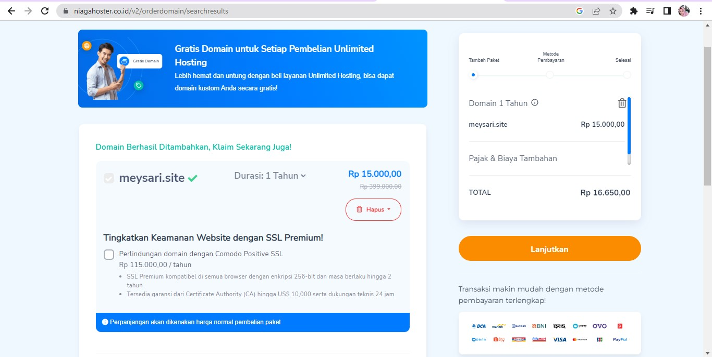

#Link tugas Week4 Iis Meysari
Click the link https://portofolio-sari.imys.site to se my project😉

# Berikut Adalah Tutorial Custom Domain Di Netlify

### STEP 1

<h1 text-align="center"> </h1>

pertama-tama yaitu signUp di Niagahoster, dan mencari nama domain apakah tersedia atau tidak,
jika tersedia silahkan ceklis nama domain dan checkout melakukan pembayaran
