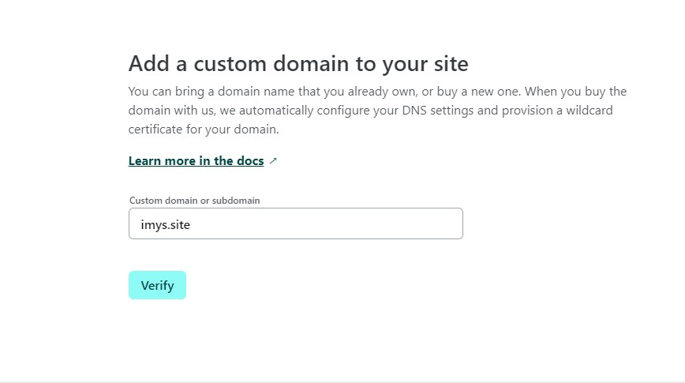

# Link tugas Week4 Iis Meysari

Click the link https://portofolio-sari.imys.site to se my project😉

# Berikut Adalah Tutorial Custom Domain Di Netlify

### STEP 1

<h1 text-align="center"> </h1>

pertama-tama yaitu signUp di Niagahoster, dan mencari nama domain apakah tersedia atau tidak,
jika tersedia silahkan ceklis nama domain dan checkout melakukan pembayaran\

### STEP 2

<h1 text-align="center"> </h1>

berikut adalah tampilah jika berhasil membeli Domain di Niaga Hoster

### STEP 3

<h1 text-align="center"> </h1>

lalu pergi ke web CloudFlare dan melakukan signUp kembali, dan di halaman website setting pilih paket sesuai keinginan kamu..

### STEP 4

<h1 text-align="center"> </h1>

jika sudah selesai akan muncul link CDN CloudFlare, atau nameServer kamu seperti ini

### STEP 5

<h1 text-align="center"> </h1>
 lalu masukan NameServer CloudFlare yang sudah kamu copy ke NiagaHosting.

### STEP 6

<h1 text-align="center"> </h1>

berikut adalah tampilan name server kamu berhasil di ubah

### STEP 7

<h1 text-align="center"> </h1>

lalu setiing domain di cloudflare, menghubungkan link web yg sudah kamu devloy di netlify seperti berikut

### STEP 8

<h1 text-align="center"> </h1>

lalu verivikasi atau tautkan link yang sudah kamu setting di cloudflare di custom domain netlify

### STEP 9

<h1 text-align="center"> </h1>

dan berikut adalah tampilan domain kamu berhasil di custom dengan domain dari niagahoster
